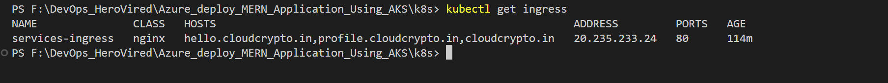

# SampleMERNwithMicroservices
Deploying a MERN (MongoDB, Express.js, React, Node.js) application using Azure Kubernetes Service (AKS) involves several steps.

## Prerequisites
1. Azure Account: Ensure you have an Azure account.
2. Azure CLI: Install the Azure CLI.
3. kubectl: Install kubectl for managing Kubernetes clusters.
4. Docker: Install Docker for containerizing the application.
5. Git: Install Git for version control.

## Step 1: Clone the Git Repository
```bash
git clone https://github.com/UnpredictablePrashant/SampleMERNwithMicroservices.git
```

## Step 2: Some Change Home.js Controller
```javascripts
const helloServiceUrl = process.env.REACT_APP_SERVICE1_URL;
const profileServiceUrl = process.env.REACT_APP_SERVICE2_URL;

useEffect(() => {
    axios
      .get(helloServiceUrl) # Change the http://localhost:3001/
      .then((response) => {
        setMessage(response.data.msg);
      })
      .catch((error) => console.error("Error fetching data:", error));
  }, []);

  useEffect(() => {
    axios
      .get(`${profileServiceUrl}fetchUser`) # Change the http://localhost:3002/fetchUser
      .then((response) => {
        setProfile(response.data);
        
      })
      .catch((error) => console.error("Error fetching data:", error));
  },[]);

```

## Step 3: Create Dockerfile for Frontend and backend microservices

- Dockerfile for Hello Service
```Dockerfile
FROM node:18

WORKDIR /app

COPY package*.json ./

RUN npm install

COPY . .

EXPOSE 3001

CMD ["node", "index.js"]

```

- Dockerfile for Profile Service
```Dockerfile
FROM node:20

WORKDIR /app

COPY package*.json ./

RUN npm install

COPY . .

EXPOSE 3002

CMD ["node", "index.js"]

```

- Dockerfile for Frontend
```Dockerfile
FROM node:18

WORKDIR /app

COPY package*.json ./

RUN npm install

COPY . .

EXPOSE 3000

CMD ["npm", "start"]

```

## Step 4: Create Docker images and pushed into dockerhub
```bash
docker build -t simple_mearn_be_micro_1 .
docker build -t simple_mearn_be_micro_2 .
docker build -t simple_mern_micro_fe .

docker tag simple_mearn_be_micro_1 surendergupta/simple_mearn_be_micro_1:latest
docker tag simple_mearn_be_micro_2 surendergupta/simple_mearn_be_micro_2:latest
docker tag simple_mern_micro_fe surendergupta/simple_mern_micro_fe:latest

docker push surendergupta/simple_mearn_be_micro_1:latest
docker push surendergupta/simple_mearn_be_micro_2:latest
docker push surendergupta/simple_mern_micro_fe:latest

```

## Step 5: Open Terminal and Login
```bash
az login
```

## Step 6: Create Resource Group and Register Resource Provider
```
Microsoft.Compute
Microsoft.ContainerInstance
Microsoft.ContainerRegistry
Microsoft.ContainerService
Microsoft.Kubernetes
Microsoft.KubernetesConfiguration
Microsoft.KubernetesRuntime
microsoft.insights
```

## Step 7: Create AKS Cluster
```bash
az aks create --resource-group mern_deploy --name mern-micro-cluster --node-count 2 --enable-addons monitoring --generate-ssh-keys

```

## Step 8: Kubectl command enable
```bash
az aks get-credentials --resource-group mern_deploy --name mern-micro-cluster
```

## Step 9: Install NGINX Ingress Controller
```bash
kubectl apply -f https://raw.githubusercontent.com/kubernetes/ingress-nginx/main/deploy/static/provider/cloud/deploy.yaml

```
## Step 10: Run Deployment, services as manifest file and Ingress file
```bash
kubectl apply -f ./manifest.yaml
kubectl apply -f ./ingress.yaml
```
## Step 11: Verify Ingress, Deployment, services
```bash
kubectl get ingress
kubectl get pod
kubectl get svc
```

## Step 12: Update DNS A Records
```text
NAME               CLASS   HOSTS                                                        ADDRESS         PORTS   AGE
services-ingress   nginx   hello.cloudcrypto.in,profile.cloudcrypto.in,cloudcrypto.in   20.235.233.24   80      89m

#COPY IP FROM GET INGRESS COMMAND 
```

## Step 13: Deployment Done With AKS

## Screenshot





